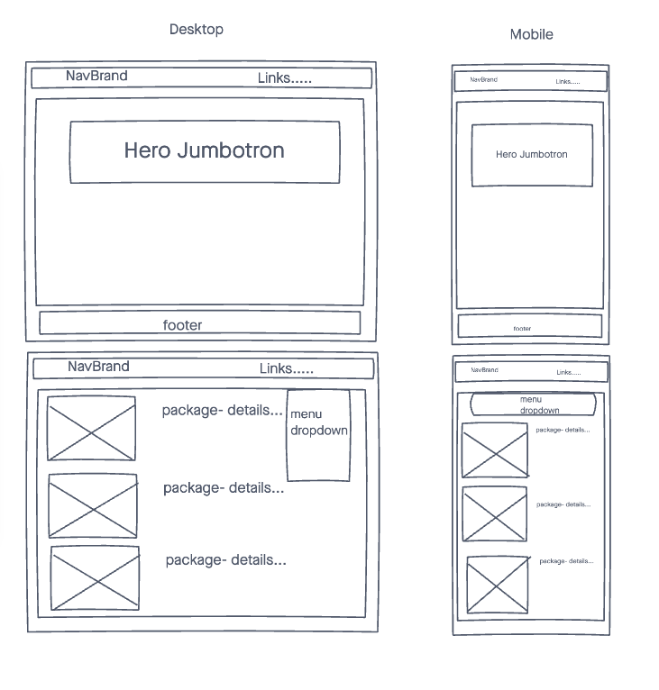
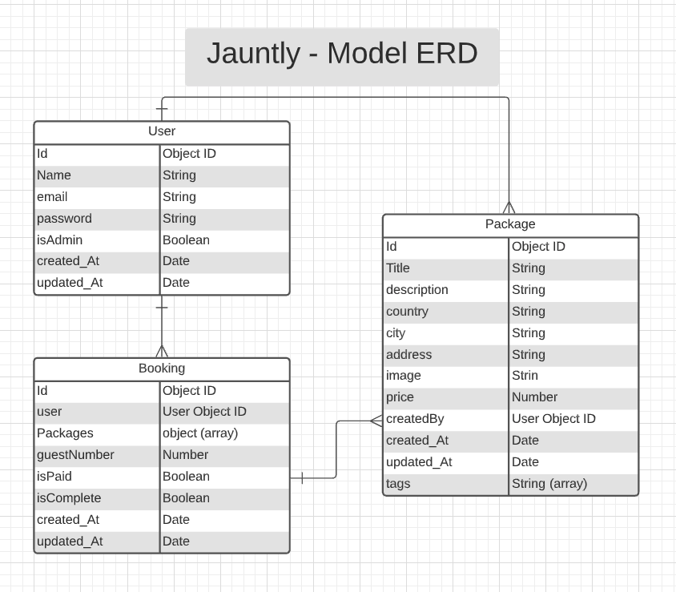
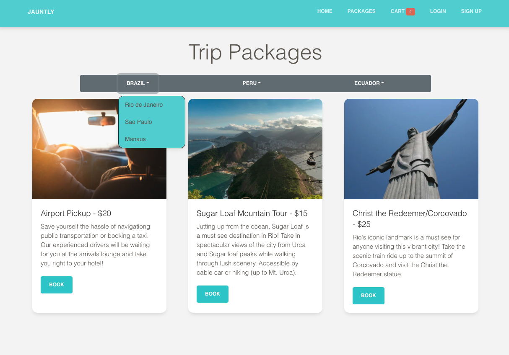
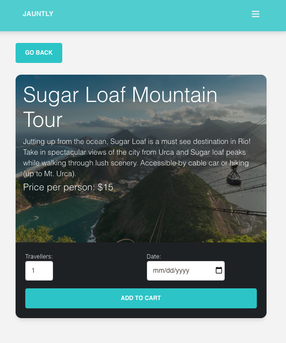
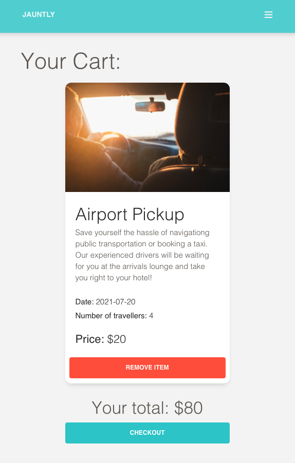
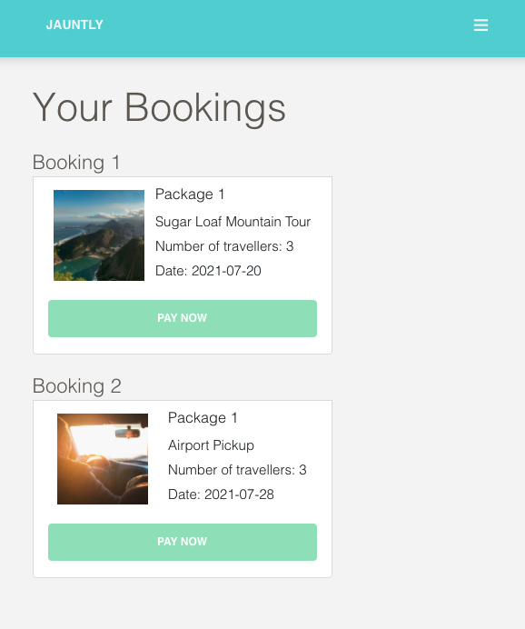
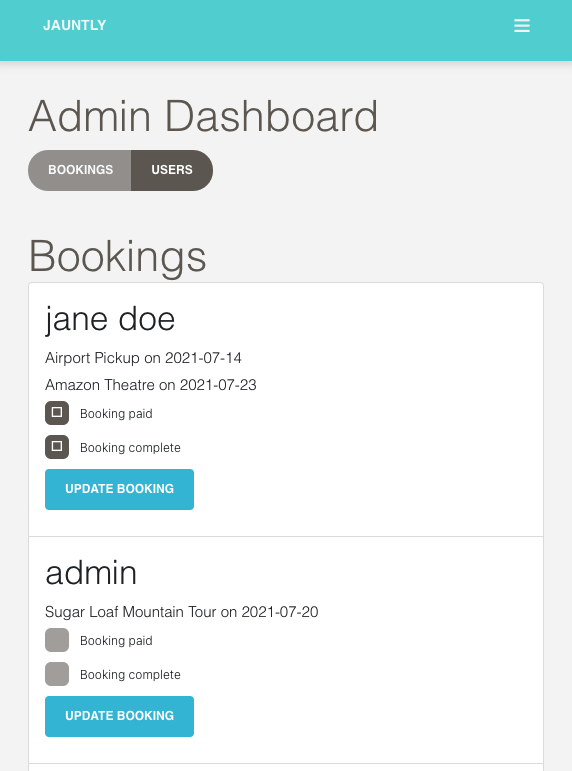

# Jauntly

An e-commerce travel package app dedicated to offering simple solutions to travellers who prefer to keep things simple and choose how to spend their time on vacation. Jauntly trip packages are designed to allow flexible and stress free trip planning that works with a travellers schedule.

Users can easily add packages to their cart, pick the date and number of guests before making a booking.

The website also featurers Admin controls/dashboard to update bookings and user details.

## Technologies

- HTML
- CSS
- JavaScript
- [Reactstrap](https://reactstrap.github.io/)
- [Paper-kit Bootstrap Library by Creative-Tim](https://www.creative-tim.com/)
- [React](https://reactjs.org/)
- [React-Router](https://reactrouter.com/)
- [React-Router-Bootstrap](https://www.npmjs.com/package/react-router-bootstrap)
- MongoDB
- Node.js
- Express
- [JSON Web Tokens](https://jwt.io/)
- [Bcrypt](https://www.npmjs.com/package/bcrypt)
- [Travel images from Unsplash.com](https://unsplash.com/)

## Screenshots

### Wireframes

### ERD

### Images of App

## Getting Started

Click [here](https://jauntly-frontend.herokuapp.com/) to visit working App

## Future Enhancements

- Search functionality
- More user options such as pay features (strip/paypal sandbox)
- Adding more styling
- Utilize local storage to persist cart information on page refresh
